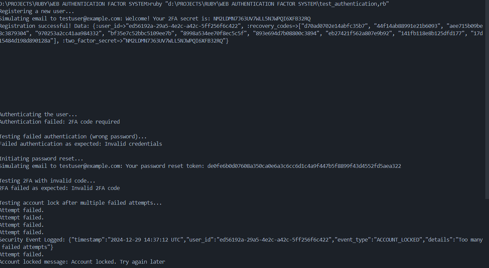

# Web Authentication System

  

A robust, secure, and extensible web authentication system built using Ruby. This system supports user registration, password hashing, two-factor authentication (2FA), password recovery, account lockout mechanisms, and secure token-based authentication (JWT).

---

## **Features**

- **User Registration**:
  - Validates strong passwords.
  - Generates recovery codes for emergency access.
  - Sends a welcome email with a 2FA secret.
- **Secure Password Handling**:
  - Uses `BCrypt` for hashing passwords with a pepper for added security.
- **Two-Factor Authentication**:
  - Integrated `ROTP` for TOTP-based 2FA.
  - Verifies codes with time drift tolerance.
- **JWT-Based Authentication**:
  - Issues secure tokens for session handling.
  - Tokens are time-limited to enhance security.
- **Account Lockout**:
  - Implements lockout after configurable failed attempts.
  - Logs security events for better traceability.
- **Password Recovery**:
  - Secure password reset via email-based tokens.
- **Pluggable and Extensible**:
  - Designed to be database-agnostic for easy integration into existing systems.

---

## **Technologies Used**

- **Ruby**: Core programming language.
- **BCrypt**: Password hashing.
- **JWT**: Token-based authentication.
- **ROTP**: Two-factor authentication.
- **SecureRandom**: For generating secure tokens and recovery codes.

---

## **Project Structure**

```
web-authentication-system/
├── web_authentication_system.rb   # Core implementation
├── test_authentication.rb         # Test script
├── .env                           # Environment variables (JWT_SECRET, PASSWORD_PEPPER)
└── README.md                      # Documentation
```

---

## **Installation and Setup**

### Prerequisites

1. Ruby installed on your system. ([Install Ruby](https://www.ruby-lang.org/en/downloads/))
2. Required gems: `bcrypt`, `jwt`, `rotp`.

### Installation Steps

1. Clone the repository:

   ```bash
   git clone https://github.com/KunjShah95/web-authentication-system.git
   cd web-authentication-system
   ```

2. Install dependencies:

   ```bash
   gem install bcrypt jwt rotp
   ```

3. Create a `.env` file and set the following variables:

   ```env
   JWT_SECRET=your_jwt_secret
   PASSWORD_PEPPER=your_password_pepper
   ```

4. Run the test script to verify functionality:
   ```bash
   ruby test_authentication.rb
   ```

---

## **Usage Instructions**

### User Registration

- Call `register_user(email, password)` to create a new user.
- Example:
  ```ruby
  auth_system.register_user('testuser@example.com', 'Secure@Password123')
  ```

### Authentication

- Call `authenticate(email, password, totp_code)` for login.
- Example:
  ```ruby
  auth_system.authenticate('testuser@example.com', 'Secure@Password123', '123456')
  ```

### Password Reset

- Call `initiate_password_reset(email)` to start the password reset process.
- Example:
  ```ruby
  auth_system.initiate_password_reset('testuser@example.com')
  ```

---

## **Testing**

Run the included test script to validate the system:

```bash
ruby test_authentication.rb
```

Expected Outputs:

1. Successful registration logs user ID, 2FA secret, and recovery codes.
2. Correct password returns a JWT token.
3. Invalid credentials trigger lockout after max attempts.
4. Password reset sends a token via simulated email.

---

## **Future Enhancements**

- **Database Integration**: Replace in-memory storage with support for SQL/NoSQL databases.
- **Email Service**: Use SMTP or third-party services like SendGrid for sending emails.
- **Admin Dashboard**: Interface for managing users, viewing logs, and handling lockouts.
- **Advanced 2FA**: Support biometric or push-based 2FA mechanisms.
- **Rate Limiting**: Implement rate-limiting to prevent brute force attacks.
- **API Documentation**: Add Swagger/OpenAPI support for RESTful integration.

---

## **Contributing**

Contributions are welcome! To contribute:

1. Fork the repository.
2. Create a feature branch: `git checkout -b feature-name`.
3. Commit changes: `git commit -m 'Add some feature'`.
4. Push to the branch: `git push origin feature-name`.
5. Open a pull request.

code output:


---

## **License**

This project is licensed under the MIT License. See `LICENSE` for details.

---

## **Acknowledgements**

- [Ruby](https://www.ruby-lang.org/)
- [BCrypt](https://github.com/codahale/bcrypt-ruby)
- [JWT](https://jwt.io/)
- [ROTP](https://github.com/mdp/rotp)

---

## **Project Badges**


---

## **Contact**

- **Author**: Kunj Shah
- **GitHub**: [Your GitHub Profile](https://github.com/KunjShah95)
